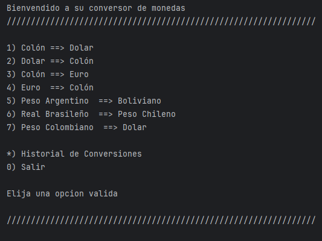
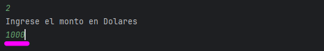
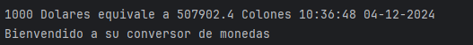
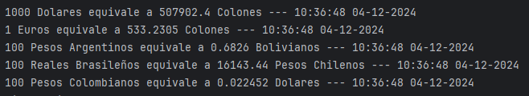
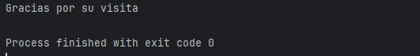

# Conversor de Monedas  

---

## 📋 Índice  
1. [Descripción del Proyecto](#-descripción-del-proyecto)
2. [Configuracion del Proyecto](#-configuracion-del-proyecto)  
3. [Demostración de Funciones](#-demostración-de-funciones-y-aplicaciones)  
4. [Acceso al Proyecto](#-acceso-al-proyecto)  
5. [Tecnologías Utilizadas](#-tecnologías-utilizadas)  
6. [Personas Desarrolladoras del Proyecto](#-personas-desarrolladoras-del-proyecto)  

---

## 📝 Descripción del Proyecto  
**[Conversor de Monedas]** es una Aplicacion diseñada para obtener el tipo de cambio de diferentes monedas pre-establecidas a través de la conexión del API Exchangerate-API. Dicha aplicación permite al usuario obtener información en tiempo real con los datos actualizados según el tipo de cambio actual.  

Por ejemplo:  
> "Obtener el monto en Colones Costarricenses segun el Tipo Cambio de Dolar Americano"

---

## 📝 Configuracion del Proyecto

- **Paso 1**: [Es necesario agregar a las dependencias el paquete Gson].  

- **Paso 2**: [Para poder utilizar la aplicación, es necesario configurar su Api-Key de Exchangerate-API generada desde la pagina ["v6.exchangerate-api.com"](https://v6.exchangerate-api.com). La configuración se realiza en la clase **ClientePeticionador** en la variable **apiKey**].  

---

## 🎥 Demostración de Funciones 
### Funciones Principales:  
- **Paso 1**: [Selecciono en el menú principal por medio del teclado numerico la opción de conversión].  
- **Paso 2**: [Indico el monto correspondiente para calcular el tipo de cambio].  
- **Paso 3**: [Obtengo el resultado de la conversion segun el monto ingresado con fecha y hora de la ejecución].
- **Paso 4**: [Obtengo el historial de conversiones con dato de fecha y hora de ejecución].
- **Paso 5**: [Selecciono finalizar la aplicación].

---

### Vista Previa:  
Incluye capturas de pantalla o GIFs de la aplicación funcionando.  
Ejemplo:  

---

## 🚀 Acceso al Proyecto  
Puedes acceder al proyecto mediante:  
- **Repositorio en GitHub**: [Enlace al repositorio](https://github.com/Jonathan-FCH/conversordemonedas)  

---

## 🛠️ Tecnologías Utilizadas  
- **Backend**: Java versión 17, Biblioteca Gson 2.10.1
---

## 👨‍💻 Personas Desarrolladoras del Proyecto  
- **Jonathan Fonseca Chacon**  
  - [LinkedIn](linkedin.com/in/jonathan-fonseca-chacon)  
  - [GitHub](https://github.com/Jonathan-FCH)  

---